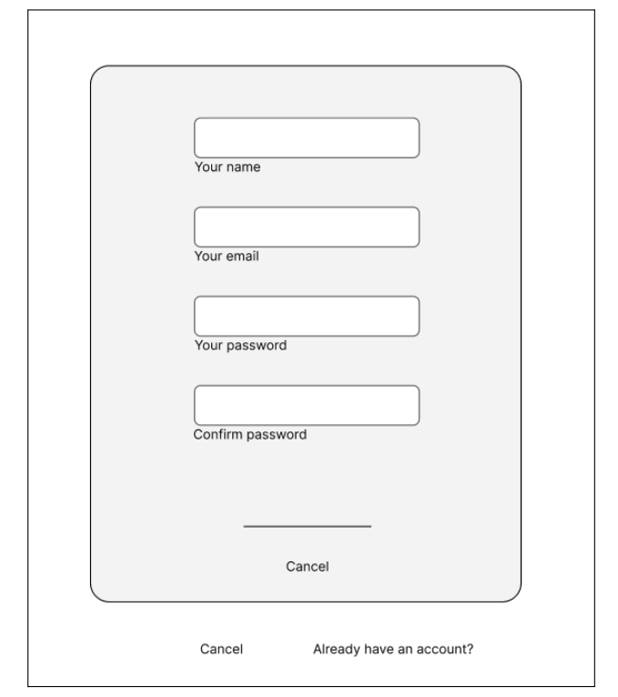
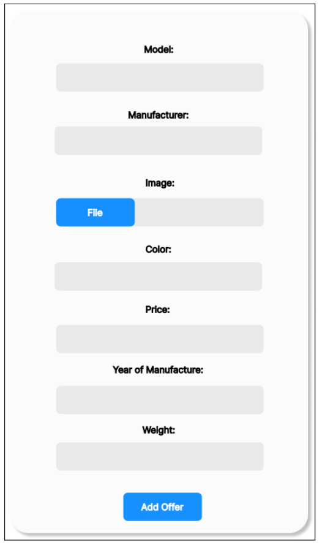

## Funkcionālās prasības :

1. Jaunu lietotāju reģistrācija:
    1.1 Jāparedz ieejas informācijas par lietotāju ievadīšana, pārbaude uz simbolu skaitu un formāta pareizību.
    1.2 Obligātu lauku pārbaude un kļūdas paziņojumu izvadīšana.
    1.3. Lietotāja vārda un ē-pasta salīdzināšana ar esošajiem lietotājiem. Izvadīs kļūdu ar atbilstošo tekstu.
    1.4. Minimālās prasības paroles ilgumam un sarežģītībai.
    1.5. Paroles glabāšana, izmantojot drošu hašēšanas algoritmu. Parole tiks ievadīta divas reizes, lai izvairītos no drukas kļūdām. Ja parole, kura tiks ievadīta atkārtoti, nesakrītīs ar sākotnējo variantu, tiks parādīta kļūda.
    1.6. Pēc veikmīgās lietotāja reģistrācijas, ziņojuma logā atnāks vēstule.
2. Lietotāja autorizācija:
    2.1. Ja lietotājs eksistē datu bāzē, sistēmai ir jānodrošina autorizācija, pieslēdzoties ar e-pastu un paroli.
    2.2. Ja kāds no laukiem nav ievadīts, izvadīt par to paziņojumu.
    2.3. Lauku ievades pārbaude uz pareizību un kļūdas paziņojumi, ja parole vai vārds nesakrīt.
    2.4. Kļūdu izvade, ja ievadītais lietotājvārds neeksistē datu bāzē.
3. Meklēšanas funkcija automašīnu klāstā:
    3.1. Ja lietotājs ievada marku vai modeli, vai visus kopā, sistēmai ir jāparāda visi attiecīgie piedāvājumi.
    3.2. Ja nav atrasti piedāvājumi, izvadīsies atbilstošs teksts.
    3.3. Sistēmai ir jānodrošina meklēšanu pēc filtru saraksta, lai lietotāji varētu viegli atlasīt vajadzīgos kritērijus, tādus kā cena un marka.
    3.4. Sistēmai ir jānodrošina meklēšana pēc kritērijiem un atslēgvārdiem kopā.
4. Forma automašīnas pirkšanai ar visiem nepieciešamajiem laukiem:
    4.1. Obligātu lauku pārbaude, telefona numurs, vārds un uzvārds, un arī ka lietotājs piekrīt nosacījumiem.
    4.2. Sistēmai ir jāparbauda vai lietotājs ievada tieši ciparus laukā priekš telefona numura un pēc nostātījuma tās sākās no “+371”.
    4.3. Sistēmai jāsaglabā informāciju par izvēlēto krāsu.
5. Apkalpojoša personāla funkcijas:
    5.1. Pasūtījumu apstiprināšana un dzēšana.
    5.2. Piedāvājumu pievienošana un dzēšana.
    5.3. Klienta un pasūtījumu informācijas apskate un izpildes statusa mainīšana.
    5.4. Jauno automašīnu krāsu pievinošana vai dzēšana.
6. Komentāru atstāšana:
    6.1. Obligātu lauku pārbaude un kļūdas paziņojumu izvadīšana.
    6.2. Lietotāju iespēja atstāt un dzēst savus komentārus.
    6.3. Komentāru laukā jābūt pārbaude uz simbolu skaitu.
    6.4. Apkalpojošajam personālam jābūt iepējai dzēst jebkādu komentāri.
7. Personīgais lietotāja konts un to rediģēšana:
    7.1. Konta informācija un personalizācijas iespējas, konta attēla maiņa.
    7.2. Lietotāja paroles rediģēšanas. Ja tagadējais parolis ir ievadīts nepareizi vai jauns parolis un atkārtoti ievadītais neskrtitīs, tad izvadīs kļūdas.
    7.3. Sistēmai ir jānodrošina visu pasūtījumu apskati priekš katra lietotāja un izvadi excel formātā.
8. Iziešana no profila:
    8.1. Katram lietotājam jābūt iespēja iziet no lietotāja konta.
9. Ziņojumu saņemšanas sistēma:
    9.1. Sistēmai jānosūta paziņojums par veiksmīgu reģistrāciju.
    9.2. Sistēmai jānosūta paziņojums par veiksmīgu pasūtīšanu.
    9.3. Lietotājam vajadzētu būt iespēja dzēst ziņojumus no sava konta pasta.
10. Transportlīdzekļa krāsu variantu attēlošana:
    10.1. Visiem lietotājiem jābūt iespējai apskatīt automobiļa krāsu variantus, un sistēmai jāuzrāda attēls ar izvēlēto krāsu.
## Nefunkcionālās prasības
1. Veiktspēja: sistēmai jānodrošina atbilde lietotājam ne ilgāk kā 2 sekundes laikā un datu bāzes jautājumiem jābūt izpildītiem ne ilgāk kā 5 sekundēs.
2. Drošība: lietotāja paroles jābūt saglabātām, izmantojot šifrēšanu. Piekļuve administratīvajām funkcijām jābūt tikai autorizētiem darbiniekiem.
3. Dizains: lietotāja saskarnē jābūt viegli saprotamai un draudzīgai lietotājiem no visdažādākajām paaudzēm. Lietotāja saskarnei jābūt responsīvai, lai nodrošinātu labu pieredzi gan datoriem, gan mobilajiem ierīcēm.  
4. Aizsardzība pret SQL injekcijām. Šī prasība paredz nodrošināt, ka sistēma ir pasargāta no iespējamām SQL injekcijām, kas var rasties, ja nepietiekami tiek pārbaudīta un filrēta lietotāja ievadītā informācija.
5. Saprotama un viegla navigācija. Šī prasība attiecas uz lietotāja pieredzi, nodrošinot sistēmu ar saprotamu un intuitīvu navigāciju.
6. Saprotama administrāciju lapa priekš apkalpojošā personāla. Šeit svarīgs ir sistēmas pārvaldības skatījums, kas ir saprotams un vienkāršs, it īpaši apkalpojošam personālam vai administratoriem.
7. Vietne darbotos bez kļūdām visās populārākajās pārlūkprogrammās, piemēram, Google Chrome, Opera, Firefox, Edge, Safari.
8. Sistēmai ir nepieciešama spēja viegli pielāgoties jaunām funkcijām vai vides izmaiņām, nodrošinot tās atjaunināšanu un paplašināšanu.
9. Sistēmai jābūt aprīkotai ar automatizētu darbību iespējām, lai nodrošinātu efektīvu darbību un minimizētu cilvēka iesaisti, it īpaši attiecībā uz rutīnas procesiem vai ilgstošām darbībām.
10. Jābūt nodrošinātam vispusīgam un pieejamam sistēmas atbalstam, lai ātri novērstu jebkādas darbības vai sistēmas kļūmes, kā arī nodrošinātu lietotāju ar palīdzību un atbalstu sistēmas izmantošanā.

*Sistēmas reģistrācijas formas skice (skat.2.att.)

2.att. Sistēmas reģistrācijas formas skice

Šī skice attēlo sistēmas interfeisu, kurā lietotāji var reģistrēties. Tajā formā ir 4 lauki un 3 pogas “Sign Up”, lai piereģistrētu jauno lietotāju, “Cancel”, lai atceltu darbību un poga “Already have an account?”, ja lietotājam jau ir konts šajā vietnē.

*Automašīnu pievienošanas formas skice (skat.3.att.)

3.att. Automašīnu pievienošanas formas skice
Šī skice attēlo sistēmas interfeisu, kurā apkalpojošs personāls var pievienot jaunas automašīnas.

